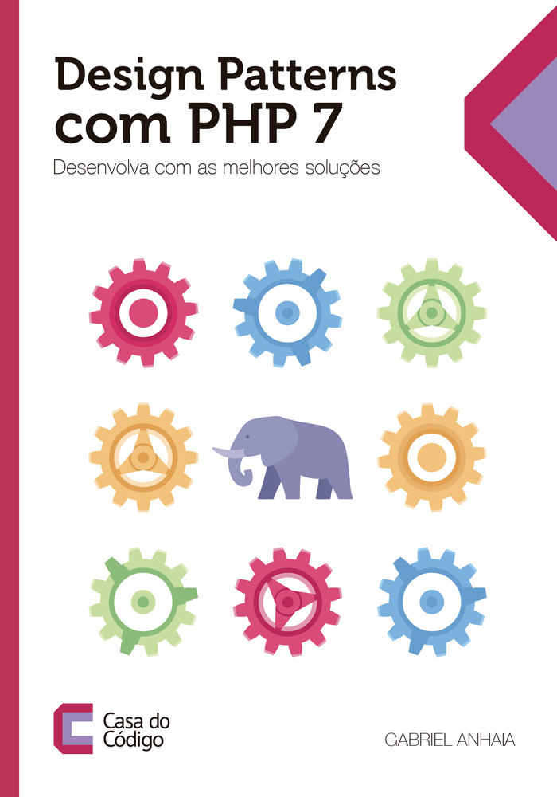

# Design Patterns com PHP 7: *Desenvolva com as melhores soluções*

Este é o repositório dos exemplos desenvolvidos no livro **Design Patterns com PHP 7: *Desenvolva com as melhores soluções*** escrito por **Gabriel Anhaia**.

{ width=50% }

O livro é distribuído pela editora [Casa do Código](www.casadocodigo.com.br), e pode ser encontrado diretamente [aqui](www.google.com.br).
